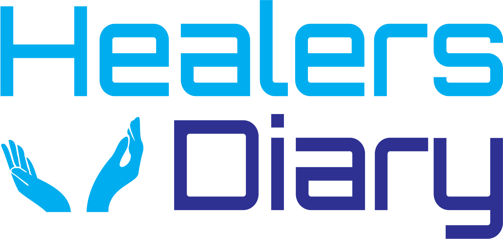
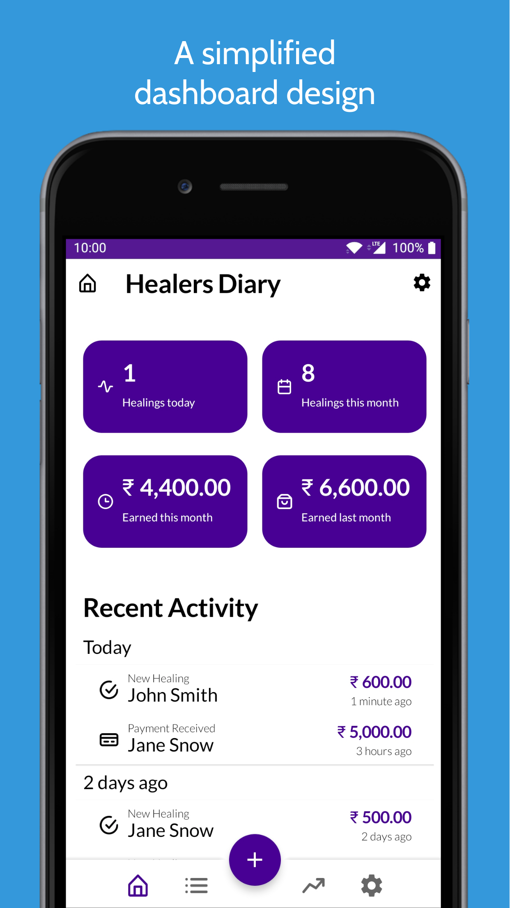
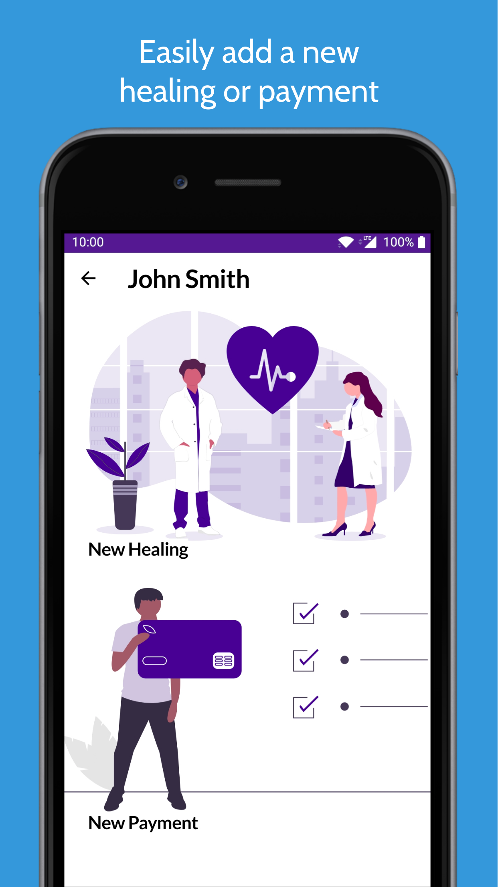
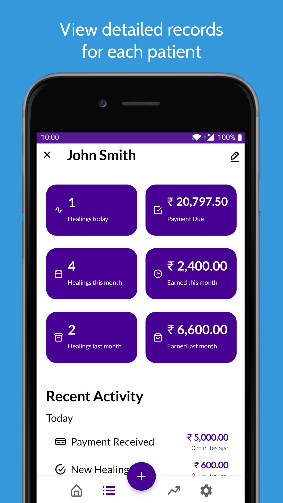
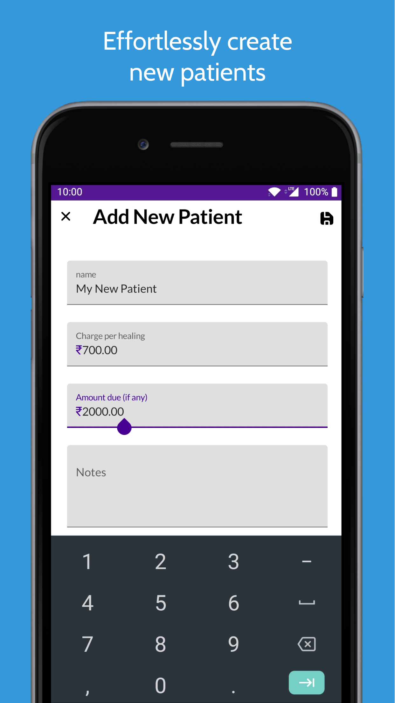
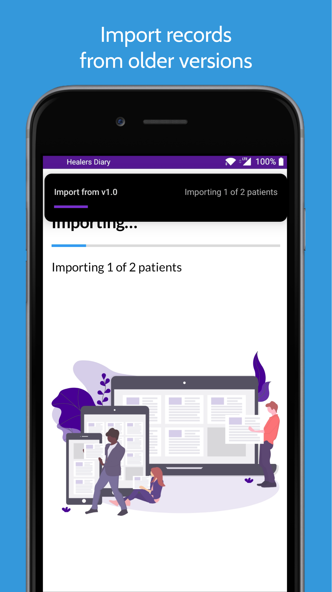

|  |  |  |  |  |
| --- | --- | --- | --- | --- |

An android app for professional healers to keep track of their patients and help in instant billing.

### Imporant: The app is currently being re-written to make it completely offline, so that your data stays on your device.

To track current status, [check out this GitHub project](https://github.com/yashovardhan99/HealersDiary/projects/2).

For the currently released version of the app, check out the [production branch](https://github.com/yashovardhan99/HealersDiary/tree/releases/production)

This new version uses the latest Jetpack libraries.

## Features
- Create, modify and delete patient records
- Keep track of healings done for each patient with the exact date and time
- Keep track of payments received and bills due
- Use the app completely offline
- View a quick summary of your healings, payments and more to stay on the top of your day
- Easy migration from v1.0 of the app

    
    
    
    
    

## Dev Bytes
* Uses latest Jetpack libraries
* Room for local persistence
* Jetpack navigation with safe-args for easier navigation.
* Flow and LiveData for staying up-to-date.
* Paging 3.0 for loading long lists
* Latest material design components
* Dynamic module with WorkManager to connect and import data from Firestore.

## V2.0 timeline
* Private Alpha - **Completed**
* Public Beta - **Released** - [Sign up for the beta](https://play.google.com/apps/testing/com.yashovardhan99.healersdiary)
* Public Release - *tentative May* 2021,
* Firestore access and all user data on Firebase will be deleted starting 2022 in a phased manner.

## Contributing and Support
Read the [Contributing guide](CONTRIBUTING.md) to learn how you can help this project.
